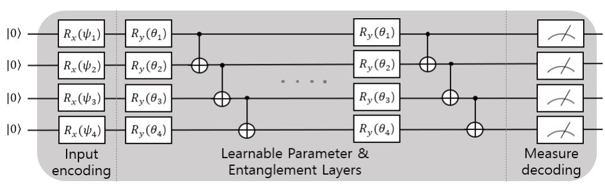
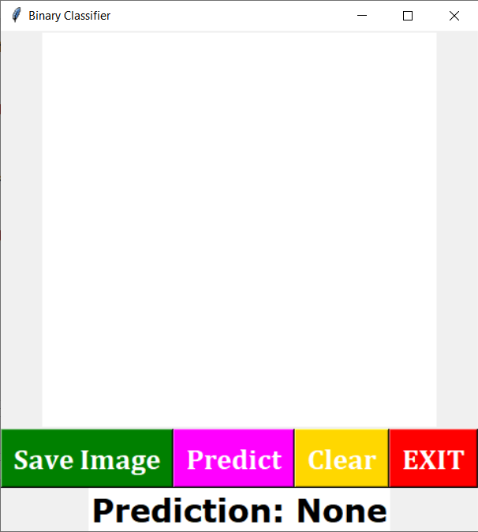
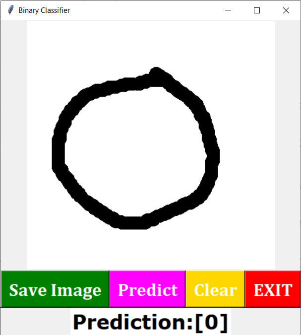

# Binary-Digit-Classifier-Using-QNN-with-GUI-input

### Project Desciption
The Project first aims to briefly introduce Quantum Neural Networks and then build a Quantum Neural Network (QNN) to classify handwritten 0 and 1 (using MNIST handwritten data). And then, we'll make a Graphical User Interface (GUI) using which the user can draw a digit. And afterward, we'll integrate the GUI with the QNN above. And then, we'll classify whether the user has made 0 or 1.

### What is Quantum Neural Network ?
A quantum neural network (QNN) is a machine learning model or algorithm that combines concepts from quantum computing and artifical neural networks.Quantum Neural Network extends the key features and structures of Neural Networks to quantum systems.
Most Quantum neural networks are developed as feed-forward networks. Similar to their classical counterparts, this structure intakes input from one layer of qubits, and passes that input onto another layer of qubits. This layer of qubits evaluates this information and passes on the output to the next layer. Eventually the path leads to the final layer of qubits.

Fig1: Illustration of QNN with the input |ψ>, the parameter θ and linear entanglement structure.[image_source](https://arxiv.org/pdf/2108.01468.pdf)

### Flowchart of the Project

### Libraries Used
- **cirq**
- **tensorflow** 
- **tensorflow_quantum**
- **numpy**
- **sympy**
- **seaborn**
- **matplotlib**
- **tkinter**
- **opencv**

####  Screenshot of the Working GUI

### References
- https://arxiv.org/pdf/1802.06002.pdf
- https://www.tensorflow.org/quantum/tutorials/mnist
- https://docs.python.org/3/library/tk.html
- https://tkdocs.com/tutorial/index.html
- https://pennylane.ai/qml/glossary/quantum_neural_network.html
- https://en.wikipedia.org/wiki/Quantum_neural_network

#### Summary Limitation and Future Work:
Encoding and handling 28x28 image is much too large for current quantum computers, so it had been downscaled. But downscaling the image to 4x4 has severely affected the Neural Network's performance. There are many instances where the developed Quantum Neural Network doesn't perform well.
For the future extension of the Project, It can be further extended to classify all digits, and GUI can be made even more beautiful with some added features like uploading the scanned images, etc.   

