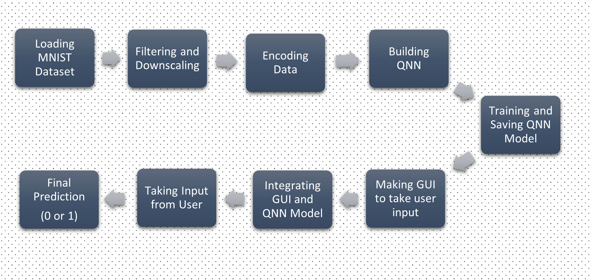

# Binary-Digit-Classifier-Using-QNN-with-GUI-input

### Project Desciption
The Project first aims to briefly introduce Quantum Neural Networks and then build a Quantum Neural Network (QNN) to classify handwritten 0 and 1 (using MNIST handwritten data). And then, we'll make a Graphical User Interface (GUI) using which the user can draw a digit. And afterward, we'll integrate the GUI with the QNN above. And then, we'll classify whether the user has made 0 or 1.

### Flowchart

### Libraries Used
- **cirq**
- **tensorflow** 
- **tensorflow_quantum**
- **numpy**
- **sympy**
- **seaborn**
- **matplotlib**
- **tkinter**
- **opencv**

####  [Final phase work will be updated soon]

### References
- https://arxiv.org/pdf/1802.06002.pdf
- https://www.tensorflow.org/quantum/tutorials/mnist
- https://docs.python.org/3/library/tk.html
- https://tkdocs.com/tutorial/index.html
- https://pennylane.ai/qml/glossary/quantum_neural_network.html
- https://en.wikipedia.org/wiki/Quantum_neural_network
